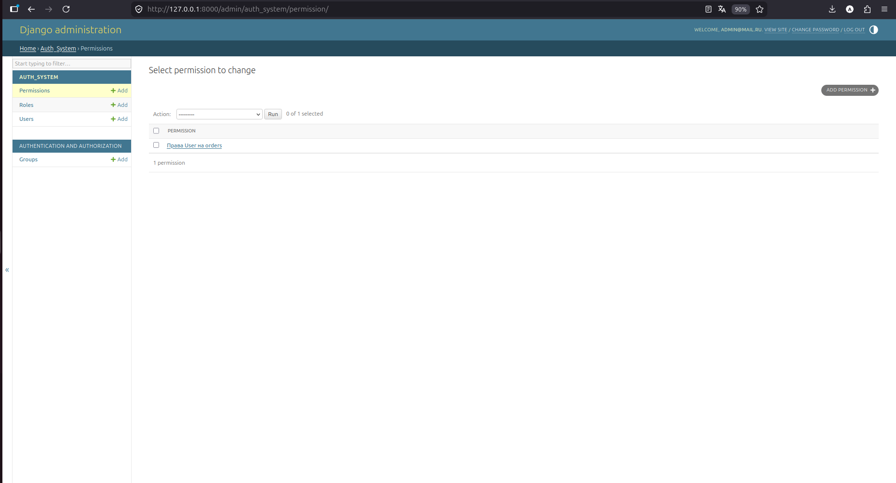
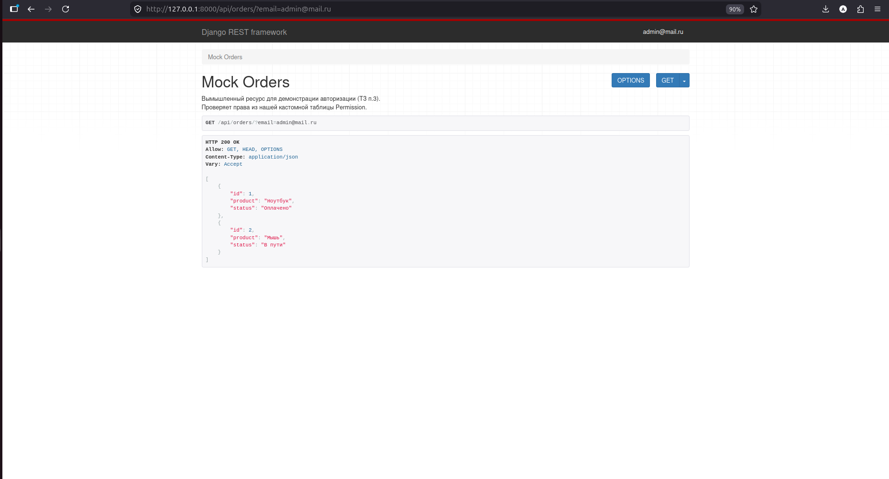

g# Система аутентификации и авторизации (RBAC)

Данный проект представляет собой backend-приложение с кастомной системой управления доступом на основе ролей (RBAC), реализованное на базе Django и Django REST Framework.

### Ключевые особенности реализации
* **Собственная модель пользователя:** Реализована на базе `AbstractBaseUser`. Авторизация происходит по полю `email`.
* **Независимая система RBAC:** Управление правами вынесено в отдельные сущности `Role` и `Permission`, что позволяет гибко настраивать доступ к ресурсам без изменения программного кода.
* **JWT-авторизация:** Использование JSON Web Tokens для идентификации пользователей и подтверждения сессии.
* **Мягкое удаление (Soft Delete):** Реализована деактивация аккаунтов (`is_active=False`) с сохранением данных в БД.

### Архитектура базы данных

1. **User (Пользователь):**
   - `fio` — полное имя пользователя.
   - `email` — уникальный идентификатор (логин).
   - `is_deleted` / `is_active` — флаги управления статусом аккаунта.
   - `role` — внешняя связь с таблицей ролей.

2. **Role (Роль):**
   - `name` — наименование уровня доступа (например: «Администратор», «Пользователь»).

3. **Permission (Права доступа):**
   - `resource_name` — строковый идентификатор защищаемого ресурса (например, `orders`).
   - `can_read` / `can_write` — флаги разрешений на чтение и изменение.

### Основной функционал

* **Взаимодействие с пользователем:** Регистрация, аутентификация, обновление профиля и мягкое удаление аккаунта.
* **Logout:** Эндпоинт для завершения сессии на стороне клиента.
* **Разграничение доступа (Mock-Views):**
   - При отсутствии авторизации — **401 Unauthorized**.
   - При авторизации, но отсутствии прав в таблице `Permission` — **403 Forbidden**.
   - При наличии прав — успешное предоставление доступа к данным.

### Установка и запуск

1. Миграции базы данных:
   python manage.py makemigrations
   python manage.py migrate
   
2.Запуск сервера:
   python manage.py runserver

3.Тестирование:
Для демонстрации работы системы прав реализован эндпоинт GET /api/orders/. 
Доступ открывается только пользователям, чья роль имеет активное разрешение в таблице Permission для ресурса orders.

### Демонстрация работы

**1. Настройка прав доступа (RBAC) в админ-панели**
Здесь создана связь между ролью пользователя и ресурсом:

**2. Проверка защиты (401 Unauthorized)**
При попытке входа без авторизации доступ блокируется:

**3. Успешное получение данных (200 OK)**
Когда пользователь авторизован и имеет права, данные отображаются:

